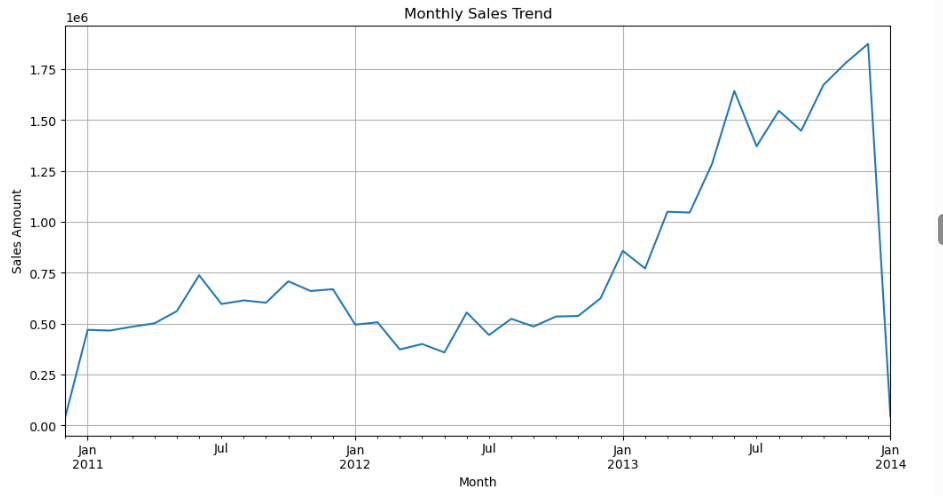
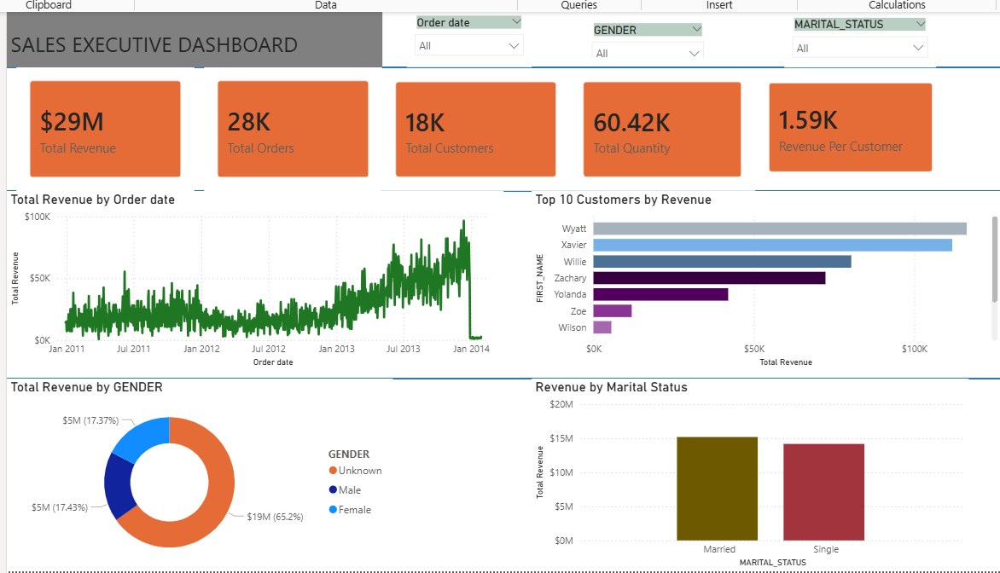

# Enterprise Sales Analytics Platform

## Overview

The Enterprise Sales Analytics Platform is an end-to-end analytics solution built using Snowflake, Python, Jupyter Notebook, and Power BI.

This project integrates CRM and ERP datasets into a centralized Snowflake Data Warehouse using the Bronze-Silver-Gold architecture, enabling business reporting, customer analytics, and executive decision-making.

---

# Solution Architecture

```text
CRM Data              ERP Data
    |                    |
    +--------+-----------+
             |
             v
      Bronze Layer
       (Raw Data)
             |
             v
      Silver Layer
 (Cleaned & Integrated)
             |
             v
       Gold Layer
 (Business Ready Data)
             |
      +------+------+
      |             |
      v             v
 Python        Power BI
 Analytics     Dashboards
```

---

# Technologies Used

- Snowflake
- SQL
- Python
- Pandas
- Jupyter Notebook
- Matplotlib
- Power BI
- Git
- GitHub

---

# Snowflake Data Warehouse

## Bronze Layer

Raw source data loaded directly from CRM and ERP systems.

### CRM Data

- CRM_CUSTOMERS_RAW
- CRM_PRODUCTS_RAW
- CRM_SALES_RAW

### ERP Data

- ERP_CUSTOMERS_RAW
- ERP_PRODUCTS_RAW
- ERP_LOCATIONS_RAW

---

## Silver Layer

The Silver Layer performs:

- Data Cleaning
- Data Standardization
- Data Integration
- Data Enrichment

### Core Tables

- DIM_CUSTOMER_STG
- DIM_PRODUCT_STG
- FACT_SALES_STG
- ERP_CUSTOMER_STG
- ERP_PRODUCT_STG

---

## Gold Layer

Business-ready datasets used for analytics.

### Dimensions

- DIM_CUSTOMER_CLEAN
- DIM_PRODUCT_PBI_CLEAN

### Facts

- FACT_SALES

---

# Data Model

```text
      DIM_CUSTOMER_CLEAN
               |
               |
               |
          FACT_SALES
               |
               |
               |
      DIM_PRODUCT_PBI_CLEAN
```

---

# Python Analytics

The Gold Layer was connected to Jupyter Notebook to perform exploratory data analysis and trend analysis.

### Monthly Sales Trend

.png

### Sales Trend Analysis

The chart below compares actual sales against the overall sales trend.

.png

### Key Findings

- Revenue increased significantly over time.
- Strong growth occurred during 2013.
- Overall sales performance demonstrated positive momentum.

---

# Power BI Executive Dashboard

An executive dashboard was built using Power BI and connected to the Snowflake Gold Layer.

## Executive Dashboard

.png

### KPI Summary

| Metric | Value |
|----------|----------|
| Total Revenue | $29M |
| Total Orders | 28K |
| Total Customers | 18K |
| Total Quantity Sold | 60.42K |
| Revenue Per Customer | $1.59K |

### Dashboard Features

- Revenue Trend Analysis
- Top Revenue Customers
- Revenue by Gender
- Revenue by Marital Status
- Interactive Filtering

---

# Customer Analytics Dashboard

images/customer_analytics_dashboard.png

### Insights

- Customer demographics contribute differently to revenue performance.
- High-value customers were identified for targeted business strategies.
- Customer segmentation supports data-driven decision making.

---

# Business Insights

## Revenue Performance

The organization generated approximately:

```text
$29 Million
```

in revenue over the analysis period.

## Customer Base

The platform analyzed approximately:

```text
18,000 Customers
```

and

```text
28,000 Orders.
```

## Revenue Growth

Sales performance increased considerably over the observed period, indicating continued business expansion.

## Customer Segmentation

Analysis revealed differences in revenue contribution across:

- Gender groups
- Marital status categories
- High-value customer segments

---

# Repository Structure

```text
Enterprise-Sales-Analytics-Platform
│
├── sql
│   └── NewDatawareHouse.sql
│
├── notebooks
│   └── Datawarehouse_and_analytic.ipynb
│
├── powerbi
│   └── Enterprise_Sales_analytics.pbix
│
├── reports
│   └── Project Documentation.pdf
│
├── images
│   ├── Dashboard(1).png
│   ├── Dashboard(2).png
│   ├── Dashboard(3).png
│   └── Dashboard(4).png
│
└── README.md
```

---

# Future Enhancements

- Sales Forecasting Models
- Demand Forecasting
- Random Forest Models
- XGBoost Forecasting
- Product Analytics Dashboard
- Customer Segmentation Models
- Microsoft Fabric Integration

---

# Project Outcomes

✅ Snowflake Data Warehouse

✅ Bronze-Silver-Gold Architecture

✅ CRM and ERP Integration

✅ Data Quality Validation

✅ Python Analytics

✅ Exploratory Data Analysis

✅ Power BI Executive Dashboard

✅ Interactive Reporting

---

# Author

**Solomon Mensah**

Data Analytics | Data Engineering | Business Intelligence

GitHub: https://github.com/Godsbrain/Enterprise-Sales-Analytics-Platform
